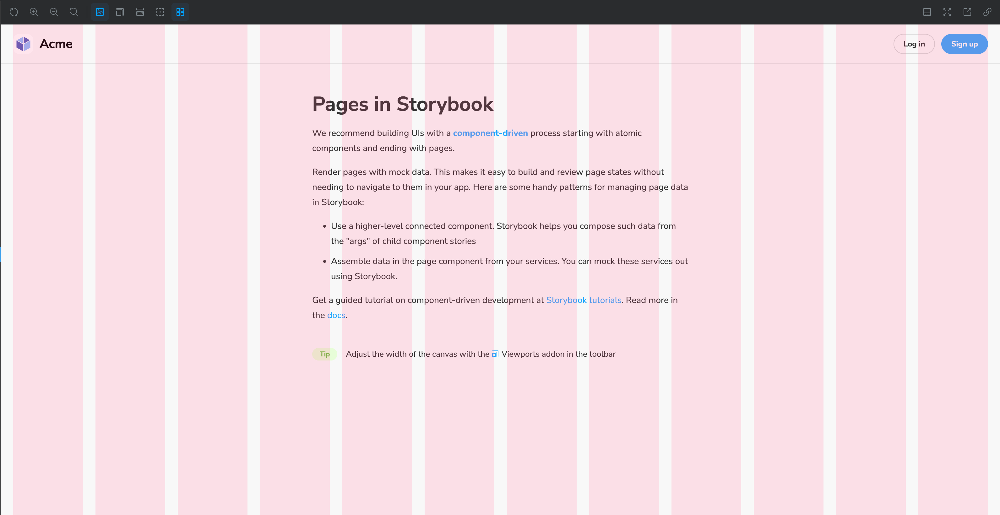

# storybook-addon-grid-overlay



Storybook addon that enhances the visual layout of your Storybook stories by providing a grid overlay. It allows you to easily align and position your components within a grid system, making it easier to create clean, consistent designs.

With this package, you can define custom grid settings, such as grid max size, column count, gap and gutter spacing, and easily toggle the grid overlay on or off while previewing your components in Storybook.

## Installation

Using npm:

```bash
npm install --save-dev storybook-addon-grid-overlay
```

Using yarn:

```bash
yarn add storybook-addon-grid-overlay --dev
```

Add the following to your _.storybook/main.js_ exports:

```js
module.exports = {
  addons: ['storybook-addon-grid-overlay']
};
```

## Customization

The grid can be customized using [parameters](https://storybook.js.org/docs/react/writing-stories/parameters), you can set them globally or per story.

### Parameters

| Name     | Description                      | Type             | Default value              | Required |
| -------- | -------------------------------- | ---------------- | -------------------------- | -------- |
| columns  | The number of columns            | number \| string | 12                         | no       |
| gap      | The gap between columns          | string           | '20px'                     | no       |
| gutter   | Horizontal gutter (spacing)      | string           | '0px'                      | no       |
| maxWidth | The maximum width of the overlay | string           | 'none'                     | no       |
| color    | The color of the columns         | string           | 'rgba(255, 71, 132, 0.15)' | no       |

#### Global setup

```js
export const parameters = {
  gridOverlay: {
    columns: 12,
    gap: '20px',
    gutter: '20px',
    maxWidth: '1024px'
  }
};
```

#### Story setup

```js
export const MyComponent = () => {...};

MyComponent.parameters = {
	gridOverlay: {
        gutter: '20px'
    }
};
```

#### Using css variables

The **storybook-addon-grid-overlay** is designed to accept CSS variables as parameters, allowing you to make the grid responsive to your designs.

```css
@media (min-width: 768px) {
  :root {
    --columns: 8;
    --gap: 12px;
    --gutter: 24px;
    --maxWidth: 1024px;
  }
}
```

```js
export const parameters = {
  gridOverlay: {
    columns: 'var(--columns)',
    gap: 'var(--gap)',
    gutter: 'var(--gutter)',
    maxWidth: 'var(--maxWidth)'
  }
};
```
